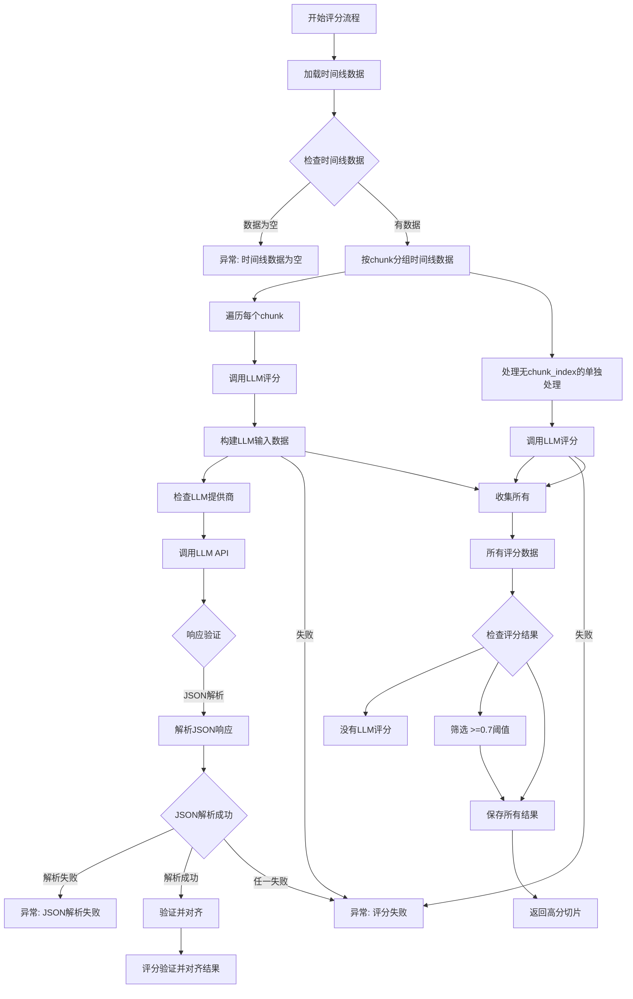

# 切片评分流程分析与优化方案

## 目录

1. [当前流程梳理](#一当前流程梳理)
2. [详细流程图](#二详细流程图)
3. [问题与缺陷分析](#三问题与缺陷分析)
4. [优化方案](#四优化方案)

---

## 一、当前流程梳理

### 1.1 整体流程概览

| 步骤 | 说明 | 涉及文件 |
|------|------|---------|
| **步骤1** | 智能切分 | `step1_outline.py` |
| **步骤2** | 时间线提取 | `step2_timeline.py` |
| **步骤3** | **内容评分（当前）** | `step3_scoring.py` |

---

## 二、详细流程图

### 2.1 评分流程详细流程图



---

## 三、问题与缺陷分析

### 3.1 核心问题清单

| 编号 | 问题类别 | 问题描述 | 严重程度 | 影响 |
|------|---------|---------|---------|------|
| 1 | **系统可靠性** | LLM失败时无容错机制缺失直接异常 | 🔴 严重 | 整个流程中断 |
| 2 | **评分标准** | 评分标准模糊，权重不清 | 🟡 中等 | 评分不一致 |
| 3 | **阈值策略** | 固定阈值不灵活 | 🟡 中等 | 不适应不同内容 |
| 4 | **无质量保证** | 没有多样性、质量无保证 | 🟡 中等 | 结果质量不稳定 |
| 5 | **内容重要性** | 重要话题可能被过滤 | 🟡 中等 | 重要信息丢失 |
| 6 | **调试能力** | 缺少评分透明度差 | 🟡 中等 | 问题难以定位 |

---

### 3.2 详细缺陷分析

#### 3.2.1 系统可靠性问题

| 问题详情 | 问题位置 |
|---------|--------|
| LLM评分失败时，直接抛出异常，整个流程中断没有任何降级或临时方案 |

**问题位置**：`step3_scoring.py`, 第313-514行

```python
except Exception as e:
    logger.error(f"块 {chunk_index} 评分异常: {str(e)}")
    raise  # 直接抛出异常
```

#### 3.2.2 评分标准模糊不清

| 问题详情 | 当前情况 |
|---------|---------|
| 评分四大维度无明确权重，依赖LLM主观判断，评分标准每次调用完全依赖提示词无一致性难以保证 |

**问题位置**：`recommendation_prompt` 中

#### 3.2.3 阈值僵化

固定阈值: 0.7固定值, 不同内容质量分布差异大, 阈值缺乏数据支撑和动态调整

**问题位置**：`step3_scoring.py`，第 439-443行

---

## 四、优化方案

### 4.1 优化方案优先级

| 方案 | 优先级 | 难度 | 实施周期 |
|------|--------|------|----------|
| A | 🔴高 | 🟢易 | 1-2天 |
| B | 🟡中 | 🟢易 | 1-2天 |
| C | 🟡中 | 🟡中 | 1-2天 |
| D | 🟡中 | 🟡中 | 2-3天 |

---

### 4.2 方案A：可靠性提升系统容错机制

#### 目标

即使LLM评分失败时，提供优雅的降级方案，保证流程能继续进行

#### 方案内容

```python
def score_clips(self, timeline_data: List[Dict]) -> List[Dict]:
    try:
        # 原有LLM评分
    except Exception as e:
        logger.error("LLM评分失败，启用备份本地评分")
        # 降级到本地评分
        return self._fallback_to_local(timeline_data)
```

---

### 4.3 方案B：增强透明度和解释

#### 目标

记录评分过程的评分细节，提升可调试性

#### 方案内容

```python
# 增强日志改进：
- 每个阶段保存原方案中添加详细评分，
```

---

### 4.4 方案C：增强评分框架

#### 目标

提供评分评分评分评分评分评分评分评分评分评分评分评分评分评分评分评分评分评分评分评分评分评分评分评分评分评分评分评分评分评分评分评分评分评分评分评分评分评分评分评分评分评分评分评分评分评分评分评分评分评分评分评分评分评分评分评分评分评分评分评分评分评分评分评分评分评分评分评分评分评分评分评分评分评分评分评分评分评分评分评分评分评分评分评分评分评分评分评分评分评分评分评分评分评分评分评分评分评分评分评分评分评分评分评分评分评分评分评分评分评分评分评分评分评分评分评分评分评分评分评分评分评分评分评分评分评分评分评分评分评分评分评分评分评分评分评分评分评分评分评分评分评分评分评分评分评分评分评分评分评分评分评分评分评分评分评分评分评分评分评分评分评分评分评分评分评分评分评分评分评分评分评分评分评分评分评分评分评分评分评分评分评分评分评分评分评分评分评分评分评分评分评分评分评分评分评分评分评分评分评分评分评分评分评分评分评分评分评分评分评分评分评分评分评分评分评分评分评分评分评分评分评分评分评分评分评分评分评分评分评分评分评分评分评分评分评分评分评分评分评分评分评分评分评分评分评分评分评分评分评分评分评分评分评分评分评分评分评分评分评分评分评分评分评分评分评分评分评分评分评分评分评分评分评分评分评分评分评分评分评分评分评分评分评分评分评分评分评分评分评分评分评分评分评分评分评分评分评分评分评分评分评分评分评分评分评分评分评分评分评分评分评分评分评分评分评分评分评分评分评分评分评分评分评分评分评分评分评分评分评分评分评分评分评分评分评分评分评分评分评分评分评分评分评分评分评分评分评分评分评分评分评分评分评分评分评分评分评分评分评分评分评分评分评分评分评分评分评分评分评分评分评分评分评分评分评分评分评分评分评分评分评分评分评分评分评分评分评分评分评分评分评分评分评分评分评分评分评分评分评分评分评分评分评分评分评分评分评分评分评分评分评分评分评分评分评分评分评分评分评分评分评分评分评分评分评分评分评分评分评分评分评分评分评分评分评分评分评分评分评分评分评分评分评分评分评分评分评分评分评分评分评分评分评分评分评分评分评分评分评分评分评分评分评分评分评分评分评分评分评分评分评分评分评分评分评分评分评分评分评分评分评分评分评分评分评分评分评分评分评分评分评分评分评分评分评分评分评分评分评分评分评分评分评分评分评分评分评分评分评分评分评分评分评分评分评分评分评分评分评分评分评分评分评分评分评分评分评分评分评分评分评分评分评分评分评分评分评分评分评分评分评分评分评分评分评分评分评分评分评分评分评分评分评分评分评分评分评分评分评分评分评分评分评分评分评分评分评分评分评分评分评分评分评分评分评分评分评分评分评分评分评分评分评分评分评分评分评分评分评分评分评分评分评分评分评分评分评分评分评分评分评分评分评分评分评分评分评分评分评分评分评分评分评分评分评分评分评分评分评分评分评分评分评分评分评分评分评分评分评分评分评分评分评分评分评分评分评分评分评分评分评分评分评分评分评分评分评分评分评分评分评分评分评分评分评分评分评分评分评分评分评分评分评分评分评分评分评分评分评分评分评分评分评分评分评分评分评分评分评分评分评分评分评分评分评分评分评分评分评分评分评分评分评分评分评分评分评分评分评分评分评分评分评分评分评分评分评分评分评分评分评分评分评分评分评分评分评分评分评分评分评分评分评分评分评分评分评分评分评分评分评分评分评分评分评分评分评分评分评分评分评分评分评分评分评分评分评分评分评分评分评分评分评分评分评分评分评分评分评分评分评分评分评分评分评分评分评分评分评分评分评分评分评分评分评分评分评分评分评分评分评分评分评分评分评分评分评分评分评分评分评分评分评分评分评分评分评分评分评分评分评分评分评分评分评分评分评分评分评分评分评分评分评分评分评分评分评分评分评分评分评分评分评分评分评分评分评分评分评分评分评分评分评分评分评分评分评分评分评分评分评分评分评分评分评分评分评分评分评分评分评分评分评分评分评分评分评分评分评分评分评分评分评分评分评分评分评分评分评分评分评分评分评分评分评分评分评分评分评分评分评分评分评分评分评分评分评分评分评分评分评分评分评分评分评分评分评分评分评分评分评分评分评分评分评分评分评分评分评分评分评分评分评分评分评分评分评分评分评分评分评分评分评分评分评分评分评分评分评分评分评分评分评分评分评分评分评分评分评分评分评分评分评分评分评分评分评分评分评分评分评分评分评分评分评分评分评分评分评分评分评分评分评分评分评分评分评分评分评分评分评分评分评分评分评分评分评分评分评分评分评分评分评分评分评分评分评分评分评分评分评分评分评分评分评分评分评分评分评分评分评分评分评分评分评分评分评分评分评分评分评分评分评分评分评分评分评分评分评分评分评分评分评分评分评分评分评分评分评分评分评分评分评分评分评分评分评分评分评分评分评分评分评分评分评分评分评分评分评分评分评分评分评分评分评分评分评分评分评分评分评分评分评分评分评分评分评分评分评分评分评分评分评分评分评分评分评分评分评分评分评分评分评分评分评分评分评分评分评分评分评分评分评分评分评分评分评分评分评分评分评分评分评分评分评分评分评分评分评分评分评分评分评分评分评分评分评分评分评分评分评分评分评分评分评分评分评分评分评分评分评分评分评分评分评分评分评分评分评分评分评分评分评分评分评分评分评分评分评分评分评分评分评分评分评分评分评分评分评分评分评分评分评分评分评分评分评分评分评分评分评分评分评分评分评分评分评分评分评分评分评分评分评分评分评分评分评分评分评分评分评分评分评分评分评分评分评分评分评分评分评分评分评分评分评分评分评分评分评分评分评分评分评分评分评分评分评分评分评分评分评分评分评分评分评分评分评分评分评分评分评分评分评分评分评分评分评分评分评分评分评分评分评分评分评分评分评分评分评分评分评分评分评分评分评分评分评分评分评分评分评分评分评分评分评分评分评分评分评分评分评分评分评分评分评分评分评分评分评分评分评分评分评分评分评分评分评分评分评分评分评分评分评分评分评分评分评分评分评分评分评分评分评分评分评分评分评分评分评分评分评分评分评分评分评分评分评分评分评分评分评分评分评分评分评分评分评分评分评分评分评分评分评分评分评分评分评分评分评分评分评分评分评分评分评分评分评分评分评分评分评分评分评分评分评分评分评分评分评分评分评分评分评分评分评分评分评分评分评分评分评分评分评分评分评分评分评分评分评分评分评分评分评分评分评分评分评分评分评分评分评分评分评分评分评分评分评分评分评分评分评分评分评分评分评分评分评分评分评分评分评分评分评分评分评分评分评分评分评分评分评分评分评分评分评分评分评分评分评分评分评分评分评分评分评分评分评分评分评分评分评分评分评分评分评分评分评分评分评分评分评分评分评分评分评分评分评分评分评分评分评分评分评分评分评分评分评分评分评分评分评分评分评分评分评分评分评分评分评分评分评分评分评分评分评分评分评分评分评分评分评分评分评分评分评分评分评分评分评分评分评分评分评分评分评分评分评分评分评分评分评分评分评分评分评分评分评分评分评分评分评分评分评分评分评分评分评分评分评分评分评分评分评分评分评分评分评分评分评分评分评分评分评分评分评分评分评分评分评分评分评分评分评分评分评分评分评分评分评分评分评分评分评分评分评分评分评分评分评分评分评分评分评分评分评分评分评分评分评分评分评分评分评分评分评分评分评分评分评分评分评分评分评分评分评分评分评分评分评分评分评分评分评分评分评分评分评分评分评分评分评分评分评分评分评分评分评分评分评分评分评分评分评分评分评分评分评分评分评分评分评分评分评分评分评分评分评分评分评分评分评分评分评分评分评分评分评分评分评分评分评分评分评分评分评分评分评分评分评分评分评分评分评分评分评分评分评分评分评分评分评分评分评分评分评分评分评分评分评分评分评分评分评分评分评分评分评分评分评分评分评分评分评分评分评分评分评分评分评分评分评分评分评分评分评分评分评分评分评分评分评分评分评分评分评分评分评分评分评分评分评分评分评分评分评分评分评分评分评分评分评分评分评分评分评分评分评分评分评分评分评分评分评分评分评分评分评分评分评分评分评分评分评分评分评分评分评分评分评分评分评分评分评分评分评分评分评分评分评分评分评分评分评分评分评分评分评分评分评分评分评分评分评分评分评分评分评分评分评分评分评分评分评分评分评分评分评分评分评分评分评分评分评分评分评分评分评分评分评分评分评分评分评分评分评分评分评分评分评分评分评分评分评分评分评分评分评分评分评分评分评分评分评分评分评分评分评分评分评分评分评分评分评分评分评分评分评分评分评分评分评分评分评分评分评分评分评分评分评分评分评分评分评分评分评分评分评分评分评分评分评分评分评分评分评分评分评分评分评分评分评分评分评分评分评分评分评分评分评分评分评分评分评分评分评分评分评分评分评分评分评分评分评分评分评分评分评分评分评分评分评分评分评分评分评分评分评分评分评分评分评分评分评分评分评分评分评分评分评分评分评分评分评分评分评分评分评分评分评分评分评分评分评分评分评分评分评分评分评分评分评分评分评分评分评分评分评分评分评分评分评分评分评分评分评分评分评分评分评分评分评分评分评分评分评分评分评分评分评分评分评分评分评分评分评分评分评分评分评分评分评分评分评分评分评分评分评分评分评分评分评分评分评分评分评分评分评分评分评分评分评分评分评分评分评分评分评分评分评分评分评分评分评分评分评分评分评分评分评分评分评分评分评分评分评分评分评分评分评分评分评分评分评分评分评分评分评分评分评分评分评分评分评分评分评分评分评分评分评分评分评分评分评分评分评分评分评分评分评分评分评分评分评分评分评分评分评分评分评分评分评分评分评分评分评分评分评分评分评分评分评分评分评分评分评分评分评分评分评分评分评分评分评分评分评分评分评分评分评分评分评分评分评分评分评分评分评分评分评分评分评分评分评分评分评分评分评分评分评分评分评分评分评分评分评分评分评分评分评分评分评分评分评分评分评分评分评分评分评分评分评分评分评分评分评分评分评分评分评分评分评分评分评分评分评分评分评分评分评分评分评分评分评分评分评分评分评分评分评分评分评分评分评分评分评分评分评分评分评分评分评分评分评分评分评分评分评分评分评分评分评分评分评分评分评分评分评分评分评分评分评分评分评分评分评分评分评分评分评分评分评分评分评分评分评分评分评分评分评分评分评分评分评分评分评分评分评分评分评分评分评分评分评分评分评分评分评分评分评分评分评分评分评分评分评分评分评分评分评分评分评分评分评分评分评分评分评分评分评分评分评分评分评分评分评分评分评分评分评分评分评分评分评分评分评分评分评分评分评分评分评分评分评分评分评分评分评分评分评分评分评分评分评分评分评分评分评分评分评分评分评分评分评分评分评分评分评分评分评分评分评分评分评分评分评分评分评分评分评分评分评分评分评分评分评分评分评分评分评分评分评分评分评分评分评分评分评分评分评分评分评分评分评分评分评分评分评分评分评分评分评分评分评分评分评分评分评分评分评分评分评分评分评分评分评分评分评分评分评分评分评分评分评分评分评分评分评分评分评分评分评分评分评分评分评分评分评分评分评分评分评分评分评分评分评分评分评分评分评分评分评分评分评分评分评分评分评分评分评分评分评分评分评分评分评分评分评分评分评分评分评分评分评分评分评分评分评分评分评分评分评分评分评分评分评分评分评分评分评分评分评分评分评分评分评分评分评分评分评分评分评分评分评分评分评分评分评分评分评分评分评分评分评分评分评分评分评分评分评分评分评分评分评分评分评分评分评分评分评分评分评分评分评分评分评分评分评分评分评分评分评分评分评分评分评分评分评分评分评分评分评分评分评分评分评分评分评分评分评分评分评分评分评分评分评分评分评分评分评分评分评分评分评分评分评分评分评分评分评分评分评分评分评分评分评分评分评分评分评分评分评分评分评分评分评分评分评分评分评分评分评分评分评分评分评分评分评分评分评分评分评分评分评分评分评分评分评分评分评分评分评分评分评分评分评分评分评分评分评分评分评分评分评分评分评分评分评分评分评分评分评分评分评分评分评分评分评分评分评分评分评分评分评分评分评分评分评分评分评分评分评分评分评分评分评分评分评分评分评分评分评分评分评分评分评分评分评分评分评分评分评分评分评分评分评分评分评分评分评分评分评分评分评分评分评分评分评分评分评分评分评分评分评分评分评分评分评分评分评分评分评分评分评分评分评分评分评分评分评分评分评分评分评分评分评分评分评分评分评分评分评分评分评分评分评分评分评分评分评分评分评分评分评分评分评分评分评分评分评分评分评分评分评分评分评分评分评分评分评分评分评分评分评分评分评分评分评分评分评分评分评分评分评分评分评分评分评分评分评分评分评分评分评分评分评分评分评分评分评分评分评分评分评分评分评分评分评分评分评分评分评分评分评分评分评分评分评分评分评分评分评分评分评分评分评分评分评分评分评分评分评分评分评分评分评分评分评分评分评分评分评分评分评分评分评分评分评分评分评分评分评分评分评分评分评分评分评分评分评分评分评分评分评分评分评分评分评分评分评分评分评分评分评分评分评分评分评分评分评分评分评分评分评分评分评分评分评分评分评分评分评分评分评分评分评分评分评分评分评分评分评分评分评分评分评分评分评分评分评分评分评分评分评分评分评分评分评分评分评分评分评分评分评分评分评分评分评分评分评分评分评分评分评分评分评分评分评分评分评分评分评分评分评分评分评分评分评分评分评分评分评分评分评分评分评分评分评分评分评分评分评分评分评分评分评分评分评分评分评分评分评分评分评分评分评分评分评分评分评分评分评分评分评分评分评分评分评分评分评分评分评分评分评分评分评分评分评分评分评分评分评分评分评分评分评分评分评分评分评分评分评分评分评分评分评分评分评分评分评分评分评分评分评分评分评分评分评分评分评分评分评分评分评分评分评分评分评分评分评分评分评分评分评分评分评分评分评分评分评分评分评分评分评分评分评分评分评分评分评分评分评分评分评分评分评分评分评分评分评分评分评分评分评分评分评分评分评分评分评分评分评分评分评分评分评分评分评分评分评分评分评分评分评分评分评分评分评分评分评分评分评分评分评分评分评分评分评分评分评分评分评分评分评分评分评分评分评分评分评分评分评分评分评分评分评分评分评分评分评分评分评分评分评分评分评分评分评分评分评分评分评分评分评分评分评分评分评分评分评分评分评分评分评分评分评分评分评分评分评分评分评分评分评分评分评分评分评分评分评分评分评分评分评分评分评分评分评分评分评分评分评分评分评分评分评分评分评分评分评分评分评分评分评分评分评分评分评分评分评分评分评分评分评分评分评分评分评分评分评分评分评分评分评分评分评分评分评分评分评分评分评分评分评分评分评分评分评分评分评分评分评分评分评分评分评分评分评分评分评分评分评分评分评分评分评分评分评分评分评分评分评分评分评分评分评分评分评分评分评分评分评分评分评分评分评分评分评分评分评分评分评分评分评分评分评分评分评分评分评分评分评分评分评分评分评分评分评分评分评分评分评分评分评分评分评分评分评分评分评分评分评分评分评分评分评分评分评分评分评分评分评分评分评分评分评分评分评分评分评分评分评分评分评分评分评分评分评分评分评分评分评分评分评分评分评分评分评分评分评分评分评分评分评分评分评分评分评分评分评分评分评分评分评分评分评分评分评分评分评分评分评分评分评分评分评分评分评分评分评分评分评分评分评分评分评分评分评分评分评分评分评分评分评分评分评分评分评分评分评分评分评分评分评分评分评分评分评分评分评分评分评分评分评分评分评分评分评分评分评分评分评分评分评分评分评分评分评分评分评分评分评分评分评分评分评分评分评分评分评分评分评分评分评分评分评分评分评分评分评分评分评分评分评分评分评分评分评分评分评分评分评分评分评分评分评分评分评分评分评分评分评分评分评分评分评分评分评分评分评分评分评分评分评分评分评分评分评分评分评分评分评分评分评分评分评分评分评分评分评分评分评分评分评分评分评分评分评分评分评分评分评分评分评分评分评分评分评分评分评分评分评分评分评分评分评分评分评分评分评分评分评分评分评分评分评分评分评分评分评分评分评分评分评分评分评分评分评分评分评分评分评分评分评分评分评分评分评分评分评分评分评分评分评分评分评分评分评分评分评分评分评分评分评分评分评分评分评分评分评分评分评分评分评分评分评分评分评分评分评分评分评分评分评分评分评分评分评分评分评分评分评分评分评分评分评分评分评分评分评分评分评分评分评分评分评分评分评分评分评分评分评分评分评分评分评分评分评分评分评分评分评分评分评分评分评分评分评分评分评分评分评分评分评分评分评分评分评分评分评分评分评分评分评分评分评分评分评分评分评分评分评分评分评分评分评分评分评分评分评分评分评分评分评分评分评分评分评分评分评分评分评分评分评分评分评分评分评分评分评分评分评分评分评分评分评分评分评分评分评分评分评分评分评分评分评分评分评分评分评分评分评分评分评分评分评分评分评分评分评分评分评分评分评分评分评分评分评分评分评分评分评分评分评分评分评分评分评分评分评分评分评分评分评分评分评分评分评分评分评分评分评分评分评分评分评分评分评分评分评分评分评分评分评分评分评分评分评分评分评分评分评分评分评分评分评分评分评分评分评分评分评分评分评分评分评分评分评分评分评分评分评分评分评分评分评分评分评分评分评分评分评分评分评分评分评分评分评分评分评分评分评分评分评分评分评分评分评分评分评分评分评分评分评分评分评分评分评分评分评分评分评分评分评分评分评分评分评分评分评分评分评分评分评分评分评分评分评分评分评分评分评分评分评分评分评分评分评分评分评分评分评分评分评分评分评分评分评分评分评分评分评分评分评分评分评分评分评分评分评分评分评分评分评分评分评分评分评分评分评分评分评分评分评分评分评分评分评分评分评分评分评分评分评分评分评分评分评分评分评分评分评分评分评分评分评分评分评分评分评分评分评分评分评分评分评分评分评分评分评分评分评分评分评分评分评分评分评分评分评分评分评分评分评分评分评分评分评分评分评分评分评分评分评分评分评分评分评分评分评分评分评分评分评分评分评分评分评分评分评分评分评分评分评分评分评分评分评分评分评分评分评分评分评分评分评分评分评分评分评分评分评分评分评分评分评分评分评分评分评分评分评分评分评分评分评分评分评分评分评分评分评分评分评分评分评分评分评分评分评分评分评分评分评分评分评分评分评分评分评分评分评分评分评分评分评分评分评分评分评分评分评分评分评分评分评分评分评分评分评分评分评分评分评分评分评分评分评分评分评分评分评分评分评分评分评分评分评分评分评分评分评分评分评分评分评分评分评分评分评分评分评分评分评分评分评分评分评分评分评分评分评分评分评分评分评分评分评分评分评分评分评分评分评分评分评分评分评分评分评分评分评分评分评分评分评分评分评分评分评分评分评分评分评分评分评分评分评分评分评分评分评分评分评分评分评分评分评分评分评分评分评分评分评分评分评分评分评分评分评分评分评分评分评分评分评分评分评分评分评分评分评分评分评分评分评分评分评分评分评分评分评分评分评分评分评分评分评分评分评分评分评分评分评分评分评分评分评分评分评分评分评分评分评分评分评分评分评分评分评分评分评分评分评分评分评分评分评分评分评分评分评分评分评分评分评分评分评分评分评分评分评分评分评分评分评分评分评分评分评分评分评分评分评分评分评分评分评分评分评分评分评分评分评分评分评分评分评分评分评分评分评分评分评分评分评分评分评分评分评分评分评分评分评分评分评分评分评分评分评分评分评分评分评分评分评分评分评分评分评分评分评分评分评分评分评分评分评分评分评分评分评分评分评分评分评分评分评分评分评分评分评分评分评分评分评分评分评分评分评分评分评分评分评分评分评分评分评分评分评分评分评分评分评分评分评分评分评分评分评分评分评分评分评分评分评分评分评分评分评分评分评分评分评分评分评分评分评分评分评分评分评分评分评分评分评分评分评分评分评分评分评分评分评分评分评分评分评分评分评分评分评分评分评分评分评分评分评分评分评分评分评分评分评分评分评分评分评分评分评分评分评分评分评分评分评分评分评分评分评分评分评分评分评分评分评分评分评分评分评分评分评分评分评分评分评分评分评分评分评分评分评分评分评分评分评分评分评分评分评分评分评分评分评分评分评分评分评分评分评分评分评分评分评分评分评分评分评分评分评分评分评分评分评分评分评分评分评分评分评分评分评分评分评分评分评分评分评分评分评分评分评分评分评分评分评分评分评分评分评分评分评分评分评分评分评分评分评分评分评分评分评分评分评分评分评分评分评分评分评分评分评分评分评分评分评分评分评分评分评分评分评分评分评分评分评分评分评分评分评分评分评分评分评分评分评分评分评分评分评分评分评分评分评分评分评分评分评分评分评分评分评分评分评分评分评分评分评分评分评分评分评分评分评分评分评分评分评分评分评分评分评分评分评分评分评分评分评分评分评分评分评分评分评分评分评分评分评分评分评分评分评分评分评分评分评分评分评分评分评分评分评分评分评分评分评分评分评分评分评分评分评分评分评分评分评分评分评分评分评分评分评分评分评分评分评分评分评分评分评分评分评分评分评分评分评分评分评分评分评分评分评分评分评分评分评分评分评分评分评分评分评分评分评分评分评分评分评分评分评分评分评分评分评分评分评分评分评分评分评分评分评分评分评分评分评分评分评分评分评分评分评分评分评分评分评分评分评分评分评分评分评分评分评分评分评分评分评分评分评分评分评分评分评分评分评分评分评分评分评分评分评分评分评分评分评分评分评分评分评分评分评分评分评分评分评分评分评分评分评分评分评分评分评分评分评分评分评分评分评分评分评分评分评分评分评分评分评分评分评分评分评分评分评分评分评分评分评分评分评分评分评分评分评分评分评分评分评分评分评分评分评分评分评分评分评分评分评分评分评分评分评分评分评分评分评分评分评分评分评分评分评分评分评分评分评分评分评分评分评分评分评分评分评分评分评分评分评分评分评分评分评分评分评分评分评分评分评分评分评分评分评分评分评分评分评分评分评分评分评分评分评分评分评分评分评分评分评分评分评分评分评分评分评分评分评分评分评分评分评分评分评分评分评分评分评分评分评分评分评分评分评分评分评分评分评分评分评分评分评分评分评分评分评分评分评分评分评分评分评分评分评分评分评分评分评分评分评分评分评分评分评分评分评分评分评分评分评分评分评分评分评分评分评分评分评分评分评分评分评分评分评分评分评分评分评分评分评分评分评分评分评分评分评分评分评分评分评分评分评分评分评分评分评分评分评分评分评分评分评分评分评分评分评分评分评分评分评分评分评分评分评分评分评分评分评分评分评分评分评分评分评分评分评分评分评分评分评分评分评分评分评分评分评分评分评分评分评分评分评分评分评分评分评分评分评分评分评分评分评分评分评分评分评分评分评分评分评分评分评分评分评分评分评分评分评分评分评分评分评分评分评分评分评分评分评分评分评分评分评分评分评分评分评分评分评分评分评分评分评分评分评分评分评分评分评分评分评分评分评分评分评分评分评分评分评分评分评分评分评分评分评分评分评分评分评分评分评分评分评分评分评分评分评分评分评分评分评分评分评分评分评分评分评分评分评分评分评分评分评分评分评分评分评分评分评分评分评分评分评分评分评分评分评分评分评分评分评分评分评分评分评分评分评分评分评分评分评分评分评分评分评分评分评分评分评分评分评分评分评分评分评分评分评分评分评分评分评分评分评分评分评分评分评分评分评分评分评分评分评分评分评分评分评分评分评分评分评分评分评分评分评分评分评分评分评分评分评分评分评分评分评分评分评分评分评分评分评分评分评分评分评分评分评分评分评分评分评分评分评分评分评分评分评分评分评分评分评分评分评分评分评分评分评分评分评分评分评分评分评分评分评分评分评分评分评分评分评分评分评分评分评分评分评分评分评分评分评分评分评分评分评分评分评分评分评分评分评分评分评分评分评分评分评分评分评分评分评分评分评分评分评分评分评分评分评分评分评分评分评分评分评分评分评分评分评分评分评分评分评分评分评分评分评分评分评分评分评分评分评分评分评分评分评分评分评分评分评分评分评分评分评分评分评分评分评分评分评分评分评分评分评分评分评分评分评分评分评分评分评分评分评分评分评分评分评分评分评分评分评分评分评分评分评分评分评分评分评分评分评分评分评分评分评分评分评分评分评分评分评分评分评分评分评分评分评分评分评分评分评分评分评分评分评分评分评分评分评分评分评分评分评分评分评分评分评分评分评分评分评分评分评分评分评分评分评分评分评分评分评分评分评分评分评分评分评分评分评分评分评分评分评分评分评分评分评分评分评分评分评分评分评分评分评分评分评分评分评分评分评分评分评分评分评分评分评分评分评分评分评分评分评分评分评分评分评分评分评分评分评分评分评分评分评分评分评分评分评分评分评分评分评分评分评分评分评分评分评分评分评分评分评分评分评分评分评分评分评分评分评分评分评分评分评分评分评分评分评分评分评分评分评分评分评分评分评分评分评分评分评分评分评分评分评分评分评分评分评分评分评分评分评分评分评分评分评分评分评分评分评分评分评分评分评分评分评分评分评分评分评分评分评分评分评分评分评分评分评分评分评分评分评分评分评分评分评分评分评分评分评分评分评分评分评分评分评分评分评分评分评分评分评分评分评分评分评分评分评分评分评分评分评分评分评分评分评分评分评分评分评分评分评分评分评分评分评分评分评分评分评分评分评分评分评分评分评分评分评分评分评分评分评分评分评分评分评分评分评分评分评分评分评分评分评分评分评分评分评分评分评分评分评分评分评分评分评分评分评分评分评分评分评分评分评分评分评分评分评分评分评分评分评分评分评分评分评分评分评分评分评分评分评分评分评分评分评分评分评分评分评分评分评分评分评分评分评分评分评分评分评分评分评分评分评分评分评分评分评分评分评分评分评分评分评分评分评分评分评分评分评分评分评分评分评分评分评分评分评分评分评分评分评分评分评分评分评分评分评分评分评分评分评分评分评分评分评分评分评分评分评分评分评分评分评分评分评分评分评分评分评分评分评分评分评分评分评分评分评分评分评分评分评分评分评分评分评分评分评分评分评分评分评分评分评分评分评分评分评分评分评分评分评分评分评分评分评分评分评分评分评分评分评分评分评分评分评分评分评分评分评分评分评分评分评分评分评分评分评分评分评分评分评分评分评分评分评分评分评分评分评分评分评分评分评分评分评分评分评分评分评分评分评分评分评分评分评分评分评分评分评分评分评分评分评分评分评分评分评分评分评分评分评分评分评分评分评分评分评分评分评分评分评分评分评分评分评分评分评分评分评分评分评分评分评分评分评分评分评分评分评分评分评分评分评分评分评分评分评分评分评分评分评分评分评分评分评分评分评分评分评分评分评分评分评分评分评分评分评分评分评分评分评分评分评分评分评分评分评分评分评分评分评分评分评分评分评分评分评分评分评分评分评分评分评分评分评分评分评分评分评分评分评分评分评分评分评分评分评分评分评分评分评分评分评分评分评分评分评分评分评分评分评分评分评分评分评分评分评分评分评分评分评分评分评分评分评分评分评分评分评分评分评分评分评分评分评分评分评分评分评分评分评分评分评分评分评分评分评分评分评分评分评分评分评分评分评分评分评分评分评分评分评分评分评分评分评分评分评分评分评分评分评分评分评分评分评分评分评分评分评分评分评分评分评分评分评分评分评分评分评分评分评分评分评分评分评分评分评分评分评分评分评分评分评分评分评分评分评分评分评分评分评分评分评分评分评分评分评分评分评分评分评分评分评分评分评分评分评分评分评分评分评分评分评分评分评分评分评分评分评分评分评分评分评分评分评分评分评分评分评分评分评分评分评分评分评分评分评分评分评分评分评分评分评分评分评分评分评分评分评分评分评分评分评分评分评分评分评分评分评分评分评分评分评分评分评分评分评分评分评分评分评分评分评分评分评分评分评分评分评分评分评分评分评分评分评分评分评分评分评分评分评分评分评分评分评分评分评分评分评分评分评分评分评分评分评分评分评分评分评分评分评分评分评分评分评分评分评分评分评分评分评分评分评分评分评分评分评分评分评分评分评分评分评分评分评分评分评分评分评分评分评分评分评分评分评分评分评分评分评分评分评分评分评分评分评分评分评分评分评分评分评分评分评分评分评分评分评分评分评分评分评分评分评分评分评分评分评分评分评分评分评分评分评分评分评分评分评分评分评分评分评分评分评分评分评分评分评分评分评分评分评分评分评分评分评分评分评分评分评分评分评分评分评分评分评分评分评分评分评分评分评分评分评分评分评分评分评分评分评分评分评分评分评分评分评分评分评分评分评分评分评分评分评分评分评分评分评分评分评分评分评分评分评分评分评分评分评分评分评分评分评分评分评分评分评分评分评分评分评分评分评分评分评分评分评分评分评分评分评分评分评分评分评分评分评分评分评分评分评分评分评分评分评分评分评分评分评分评分评分评分评分评分评分评分评分评分评分评分评分评分评分评分评分评分评分评分评分评分评分评分评分评分评分评分评分评分评分评分评分评分评分评分评分评分评分评分评分评分评分评分评分评分评分评分评分评分评分评分评分评分评分评分评分评分评分评分评分评分评分评分评分评分评分评分评分评分评分评分评分评分评分评分评分评分评分评分评分评分评分评分评分评分评分评分评分评分评分评分评分评分评分评分评分评分评分评分评分评分评分评分评分评分评分评分评分评分评分评分评分评分评分评分评分评分评分评分评分评分评分评分评分评分评分评分评分评分评分评分评分评分评分评分评分评分评分评分评分评分评分评分评分评分评分评分评分评分评分评分评分评分评分评分评分评分评分评分评分评分评分评分评分评分评分评分评分评分评分评分评分评分评分评分评分评分评分评分评分评分评分评分评分评分评分评分评分评分评分评分评分评分评分评分评分评分评分评分评分评分评分评分评分评分评分评分评分评分评分评分评分评分评分评分评分评分评分评分评分评分评分评分评分评分评分评分评分评分评分评分评分评分评分评分评分评分评分评分评分评分评分评分评分评分评分评分评分评分评分评分评分评分评分评分评分评分评分评分评分评分评分评分评分评分评分评分评分评分评分评分评分评分评分评分评分评分评分评分评分评分评分评分评分评分评分评分评分评分评分评分评分评分评分评分评分评分评分评分评分评分评分评分评分评分评分评分评分评分评分评分评分评分评分评分评分评分评分评分评分评分评分评分评分评分评分评分评分评分评分评分评分评分评分评分评分评分评分评分评分评分评分评分评分评分评分评分评分评分评分评分评分评分评分评分评分评分评分评分评分评分评分评分评分评分评分评分评分评分评分评分评分评分评分评分评分评分评分评分评分评分评分评分评分评分评分评分评分评分评分评分评分评分评分评分评分评分评分评分评分评分评分评分评分评分评分评分评分评分评分评分评分评分评分评分评分评分评分评分评分评分评分评分评分评分评分评分评分评分评分评分评分评分评分评分评分评分评分评分评分评分评分评分评分评分评分评分评分评分评分评分评分评分评分评分评分评分评分评分评分评分评分评分评分评分评分评分评分评分评分评分评分评分评分评分评分评分评分评分评分评分评分评分评分评分评分评分评分评分评分评分评分评分评分评分评分评分评分评分评分评分评分评分评分评分评分评分评分评分评分评分评分评分评分评分评分评分评分评分评分评分评分评分评分评分评分评分评分评分评分评分评分评分评分评分评分评分评分评分评分评分评分评分评分评分评分评分评分评分评分评分评分评分评分评分评分评分评分评分评分评分评分评分评分评分评分评分评分评分评分评分评分评分评分评分评分评分评分评分评分评分评分评分评分评分评分评分评分评分评分评分评分评分评分评分评分评分评分评分评分评分评分评分评分评分评分评分评分评分评分评分评分评分评分评分评分评分评分评分评分评分评分评分评分评分评分评分评分评分评分评分评分评分评分评分评分评分评分评分评分评分评分评分评分评分评分评分评分评分评分评分评分评分评分评分评分评分评分评分评分评分评分评分评分评分评分评分评分评分评分评分评分评分评分评分评分评分评分评分评分评分评分评分评分评分评分评分评分评分评分评分评分评分评分评分评分评分评分评分评分评分评分评分评分评分评分评分评分评分评分评分评分评分评分评分评分评分评分评分评分评分评分评分评分评分评分评分评分评分评分评分评分评分评分评分评分评分评分评分评分评分评分评分评分评分评分评分评分评分评分评分评分评分评分评分评分评分评分评分评分评分评分评分评分评分评分评分评分评分评分评分评分评分评分评分评分评分评分评分评分评分评分评分评分评分评分评分评分评分评分评分评分评分评分评分评分评分评分评分评分评分评分评分评分评分评分评分评分评分评分评分评分评分评分评分评分评分评分评分评分评分评分评分评分评分评分评分评分评分评分评分评分评分评分评分评分评分评分评分评分评分评分评分评分评分评分评分评分评分评分评分评分评分评分评分评分评分评分评分评分评分评分评分评分评分评分评分评分评分评分评分评分评分评分评分评分评分评分评分评分评分评分评分评分评分评分评分评分评分评分评分评分评分评分评分评分评分评分评分评分评分评分评分评分评分评分评分评分评分评分评分评分评分评分评分评分评分评分评分评分评分评分评分评分评分评分评分评分评分评分评分评分评分评分评分评分评分评分评分评分评分评分评分评分评分评分评分评分评分评分评分评分评分评分评分评分评分评分评分评分评分评分评分评分评分评分评分评分评分评分评分评分评分评分评分评分评分评分评分评分评分评分评分评分评分评分评分评分评分评分评分评分评分评分评分评分评分评分评分评分评分评分评分评分评分评分评分评分评分评分评分评分评分评分评分评分评分评分评分评分评分评分评分评分评分评分评分评分评分评分评分评分评分评分评分评分评分评分评分评分评分评分评分评分评分评分评分评分评分评分评分评分评分评分评分评分评分评分评分评分评分评分评分评分评分评分评分评分评分评分评分评分评分评分评分评分评分评分评分评分评分评分评分评分评分评分评分评分评分评分评分评分评分评分评分评分评分评分评分评分评分评分评分评分评分评分评分评分评分评分评分评分评分评分评分评分评分评分评分评分评分评分评分评分评分评分评分评分评分评分评分评分评分评分评分评分评分评分评分评分评分评分评分评分评分评分评分评分评分评分评分评分评分评分评分评分评分评分评分评分评分评分评分评分评分评分评分评分评分评分评分评分评分评分评分评分评分评分评分评分评分评分评分评分评分评分评分评分评分评分评分评分评分评分评分评分评分评分评分评分评分评分评分评分评分评分评分评分评分评分评分评分评分评分评分评分评分评分评分评分评分评分评分评分评分评分评分评分评分评分评分评分评分评分评分评分评分评分评分评分评分评分评分评分评分评分评分评分评分评分评分评分评分评分评分评分评分评分评分评分评分评分评分评分评分评分评分评分评分评分评分评分评分评分评分评分评分评分评分评分评分评分评分评分评分评分评分评分评分评分评分评分评分评分评分评分评分评分评分评分评分评分评分评分评分评分评分评分评分评分评分评分评分评分评分评分评分评分评分评分评分评分评分评分评分评分评分评分评分评分评分评分评分评分评分评分评分评分评分评分评分评分评分评分评分评分评分评分评分评分评分评分评分评分评分评分评分评分评分评分评分评分评分评分评分评分评分评分评分评分评分评分评分评分评分评分评分评分评分评分评分评分评分评分评分评分评分评分评分评分评分评分评分评分评分评分评分评分评分评分评分评分评分评分评分评分评分评分评分评分评分评分评分评分评分评分评分评分评分评分评分评分评分评分评分评分评分评分评分评分评分评分评分评分评分评分评分评分评分评分评分评分评分评分评分评分评分评分评分评分评分评分评分评分评分评分评分评分评分评分评分评分评分评分评分评分评分评分评分评分评分评分评分评分评分评分评分评分评分评分评分评分评分评分评分评分评分评分评分评分评分评分评分评分评分评分评分评分评分评分评分评分评分评分评分评分评分评分评分评分评分评分评分评分评分评分评分评分评分评分评分评分评分评分评分评分评分评分评分评分评分评分评分评分评分评分评分评分评分评分评分评分评分评分评分评分评分评分评分评分评分评分评分评分评分评分评分评分评分评分评分评分评分评分评分评分评分评分评分评分评分评分评分评分评分评分评分评分评分评分评分评分评分评分评分评分评分评分评分评分评分评分评分评分评分评分评分评分评分评分评分评分评分评分评分评分评分评分评分评分评分评分评分评分评分评分评分评分评分评分评分评分评分评分评分评分评分评分评分评分评分评分评分评分评分评分评分评分评分评分评分评分评分评分评分评分评分评分评分评分评分评分评分评分评分评分评分评分评分评分评分评分评分评分评分评分评分评分评分评分评分评分评分评分评分评分评分评分评分评分评分评分评分评分评分评分评分评分评分评分评分评分评分评分评分评分评分评分评分评分评分评分评分评分评分评分评分评分评分评分评分评分评分评分评分评分评分评分评分评分评分评分评分评分评分评分评分评分评分评分评分评分评分评分评分评分评分评分评分评分评分评分评分评分评分评分评分评分评分评分评分评分评分评分评分评分评分评分评分评分评分评分评分评分评分评分评分评分评分评分评分评分评分评分评分评分评分评分评分评分评分评分评分评分评分评分评分评分评分评分评分评分评分评分评分评分评分评分评分评分评分评分评分评分评分评分评分评分评分评分评分评分评分评分评分评分评分评分评分评分评分评分评分评分评分评分评分评分评分评分评分评分评分评分评分评分评分评分评分评分评分评分评分评分评分评分评分评分评分评分评分评分评分评分评分评分评分评分评分评分评分评分评分评分评分评分评分评分评分评分评分评分评分评分评分评分评分评分评分评分评分评分评分评分评分评分评分评分评分评分评分评分评分评分评分评分评分评分评分评分评分评分评分评分评分评分评分评分评分评分评分评分评分评分评分评分评分评分评分评分评分评分评分评分评分评分评分评分评分评分评分评分评分评分评分评分评分评分评分评分评分评分评分评分评分评分评分评分评分评分评分评分评分评分评分评分评分评分评分评分评分评分评分评分评分评分评分评分评分评分评分评分评分评分评分评分评分评分评分评分评分评分评分评分评分评分评分评分评分评分评分评分评分评分评分评分评分评分评分评分评分评分评分评分评分评分评分评分评分评分评分评分评分评分评分评分评分评分评分评分评分评分评分评分评分评分评分评分评分评分评分评分评分评分评分评分评分评分评分评分评分评分评分评分评分评分评分评分评分评分评分评分评分评分评分评分评分评分评分评分评分评分评分评分评分评分评分评分评分评分评分评分评分评分评分评分评分评分评分评分评分评分评分评分评分评分评分评分评分评分评分评分评分评分评分评分评分评分评分评分评分评分评分评分评分评分评分评分评分评分评分评分评分评分评分评分评分评分评分评分评分评分评分评分评分评分评分评分评分评分评分评分评分评分评分评分评分评分评分评分评分评分评分评分评分评分评分评分评分评分评分评分评分评分评分评分评分评分评分评分评分评分评分评分评分评分评分评分评分评分评分评分评分评分评分评分评分评分评分评分评分评分评分评分评分评分评分评分评分评分评分评分评分评分评分评分评分评分评分评分评分评分评分评分评分评分评分评分评分评分评分评分评分评分评分评分评分评分评分评分评分评分评分评分评分评分评分评分评分评分评分评分评分评分评分评分评分评分评分评分评分评分评分评分评分评分评分评分评分评分评分评分评分评分评分评分评分评分评分评分评分评分评分评分评分评分评分评分评分评分评分评分评分评分评分评分评分评分评分评分评分评分评分评分评分评分评分评分评分评分评分评分评分评分评分评分评分评分评分评分评分评分评分评分评分评分评分评分评分评分评分评分评分评分评分评分评分评分评分评分评分评分评分评分评分评分评分评分评分评分评分评分评分评分评分评分评分评分评分评分评分评分评分评分评分评分评分评分评分评分评分评分评分评分评分评分评分评分评分评分评分评分评分评分评分评分评分评分评分评分评分评分评分评分评分评分评分评分评分评分评分评分评分评分评分评分评分评分评分评分评分评分评分评分评分评分评分评分评分评分评分评分评分评分评分评分评分评分评分评分评分评分评分评分评分评分评分评分评分评分评分评分评分评分评分评分评分评分评分评分评分评分评分评分评分评分评分评分评分评分评分评分评分评分评分评分评分评分评分评分评分评分评分评分评分评分评分评分评分评分评分评分评分评分评分评分评分评分评分评分评分评分评分评分评分评分评分评分评分评分评分评分评分评分评分评分评分评分评分评分评分评分评分评分评分评分评分评分评分评分评分评分评分评分评分评分评分评分评分评分评分评分评分评分评分评分评分评分评分评分评分评分评分评分评分评分评分评分评分评分评分评分评分评分评分评分评分评分评分评分评分评分评分评分评分评分评分评分评分评分评分评分评分评分评分评分评分评分评分评分评分评分评分评分评分评分评分评分评分评分评分评分评分评分评分评分评分评分评分评分评分评分评分评分评分评分评分评分评分评分评分评分评分评分评分评分评分评分评分评分评分评分评分评分评分评分评分评分评分评分评分评分评分评分评分评分评分评分评分评分评分评分评分评分评分评分评分评分评分评分评分评分评分评分评分评分评分评分评分评分评分评分评分评分评分评分评分评分评分评分评分评分评分评分评分评分评分评分评分评分评分评分评分评分评分评分评分评分评分评分评分评分评分评分评分评分评分评分评分评分评分评分评分评分评分评分评分评分评分评分评分评分评分评分评分评分评分评分评分评分评分评分评分评分评分评分评分评分评分评分评分评分评分评分评分评分评分评分评分评分评分评分评分评分评分评分评分评分评分评分评分评分评分评分评分评分评分评分评分评分评分评分评分评分评分评分评分评分评分评分评分评分评分评分评分评分评分评分评分评分评分评分评分评分评分评分评分评分评分评分评分评分评分评分评分评分评分评分评分评分评分评分评分评分评分评分评分评分评分评分评分评分评分评分评分评分评分评分评分评分评分评分评分评分评分评分评分评分评分评分评分评分评分评分评分评分评分评分评分评分评分评分评分评分评分评分评分评分评分评分评分评分评分评分评分评分评分评分评分评分评分评分评分评分评分评分评分评分评分评分评分评分评分评分评分评分评分评分评分评分评分评分评分评分评分评分评分评分评分评分评分评分评分评分评分评分评分评分评分评分评分评分评分评分评分评分评分评分评分评分评分评分评分评分评分评分评分评分评分评分评分评分评分评分评分评分评分评分评分评分评分评分评分评分评分评分评分评分评分评分评分评分评分评分评分评分评分评分评分评分评分评分评分评分评分评分评分评分评分评分评分评分评分评分评分评分评分评分评分评分评分评分评分评分评分评分评分评分评分评分评分评分评分评分评分评分评分评分评分评分评分评分评分评分评分评分评分评分评分评分评分评分评分评分评分评分评分评分评分评分评分评分评分评分评分评分评分评分评分评分评分评分评分评分评分评分评分评分评分评分评分评分评分评分评分评分评分评分评分评分评分评分评分评分评分评分评分评分评分评分评分评分评分评分评分评分评分评分评分评分评分评分评分评分评分评分评分评分评分评分评分评分评分评分评分评分评分评分评分评分评分评分评分评分评分评分评分评分评分评分评分评分评分评分评分评分评分评分评分评分评分评分评分评分评分评分评分评分评分评分评分评分评分评分评分评分评分评分评分评分评分评分评分评分评分评分评分评分评分评分评分评分评分评分评分评分评分评分评分评分评分评分评分评分评分评分评分评分评分评分评分评分评分评分评分评分评分评分评分评分评分评分评分评分评分评分评分评分评分评分评分评分评分评分评分评分评分评分评分评分评分评分评分评分评分评分评分评分评分评分评分评分评分评分评分评分评分评分评分评分评分评分评分评分评分评分评分评分评分评分评分评分评分评分评分评分评分评分评分评分评分评分评分评分评分评分评分评分评分评分评分评分评分评分评分评分评分评分评分评分评分评分评分评分评分评分评分评分评分评分评分评分评分评分评分评分评分评分评分评分评分评分评分评分评分评分评分评分评分评分评分评分评分评分评分评分评分评分评分评分评分评分评分评分评分评分评分评分评分评分评分评分评分评分评分评分评分评分评分评分评分评分评分评分评分评分评分评分评分评分评分评分评分评分评分评分评分评分评分评分评分评分评分评分评分评分评分评分评分评分评分评分评分评分评分评分评分评分评分评分评分评分评分评分评分评分评分评分评分评分评分评分评分评分评分评分评分评分评分评分评分评分评分评分评分评分评分评分评分评分评分评分评分评分评分评分评分评分评分评分评分评分评分评分评分评分评分评分评分评分评分评分评分评分评分评分评分评分评分评分评分评分评分评分评分评分评分评分评分评分评分评分评分评分评分评分评分评分评分评分评分评分评分评分评分评分评分评分评分评分评分评分评分评分评分评分评分评分评分评分评分评分评分评分评分评分评分评分评分评分评分评分评分评分评分评分评分评分评分评分评分评分评分评分评分评分评分评分评分评分评分评分评分评分评分评分评分评分评分评分评分评分评分评分评分评分评分评分评分评分评分评分评分评分评分评分评分评分评分评分评分评分评分评分评分评分评分评分评分评分评分评分评分评分评分评分评分评分评分评分评分评分评分评分评分评分评分评分评分评分评分评分评分评分评分评分评分评分评分评分评分评分评分评分评分评分评分评分评分评分评分评分评分评分评分评分评分评分评分评分评分评分评分评分评分评分评分评分评分评分评分评分评分评分评分评分评分评分评分评分评分评分评分评分评分评分评分评分评分评分评分评分评分评分评分评分评分评分评分评分评分评分评分评分评分评分评分评分评分评分评分评分评分评分评分评分评分评分评分评分评分评分评分评分评分评分评分评分评分评分评分评分评分评分评分评分评分评分评分评分评分评分评分评分评分评分评分评分评分评分评分评分评分评分评分评分评分评分评分评分评分评分评分评分评分评分评分评分评分评分评分评分评分评分评分评分评分评分评分评分评分评分评分评分评分评分评分评分评分评分评分评分评分评分评分评分评分评分评分评分评分评分评分评分评分评分评分评分评分评分评分评分评分评分评分评分评分评分评分评分评分评分评分评分评分评分评分评分评分评分评分评分评分评分评分评分评分评分评分评分评分评分评分评分评分评分评分评分评分评分评分评分评分评分评分评分评分评分评分评分评分评分评分评分评分评分评分评分评分评分评分评分评分评分评分评分评分评分评分评分评分评分评分评分评分评分评分评分评分评分评分评分评分评分评分评分评分评分评分评分评分评分评分评分评分评分评分评分评分评分评分评分评分评分评分评分评分评分评分评分评分评分评分评分评分评分评分评分评分评分评分评分评分评分评分评分评分评分评分评分评分评分评分评分评分评分评分评分评分评分评分评分评分评分评分评分评分评分评分评分评分评分评分评分评分评分评分评分评分评分评分评分评分评分评分评分评分评分评分评分评分评分评分评分评分评分评分评分评分评分评分评分评分评分评分评分评分评分评分评分评分评分评分评分评分评分评分评分评分评分评分评分评分评分评分评分评分评分评分评分评分评分评分评分评分评分评分评分评分评分评分评分评分评分评分评分评分评分评分评分评分评分评分评分评分评分评分评分评分评分评分评分评分评分评分评分评分评分评分评分评分评分评分评分评分评分评分评分评分评分评分评分评分评分评分评分评分评分评分评分评分评分评分评分评分评分评分评分评分评分评分评分评分评分评分评分评分评分评分评分评分评分评分评分评分评分评分评分评分评分评分评分评分评分评分评分评分评分评分评分评分评分评分评分评分评分评分评分评分评分评分评分评分评分评分评分评分评分评分评分评分评分评分评分评分评分评分评分评分评分评分评分评分评分评分评分评分评分评分评分评分评分评分评分评分评分评分评分评分评分评分评分评分评分评分评分评分评分评分评分评分评分评分评分评分评分评分评分评分评分评分评分评分评分评分评分评分评分评分评分评分评分评分评分评分评分评分评分评分评分评分评分评分评分评分评分评分评分评分评分评分评分评分评分评分评分评分评分评分评分评分评分评分评分评分评分评分评分评分评分评分评分评分评分评分评分评分评分评分评分评分评分评分评分评分评分评分评分评分评分评分评分评分评分评分评分评分评分评分评分评分评分评分评分评分评分评分评分评分评分评分评分评分评分评分评分评分评分评分评分评分评分评分评分评分评分评分评分评分评分评分评分评分评分评分评分评分评分评分评分评分评分评分评分评分评分评分评分评分评分评分评分评分评分评分评分评分评分评分评分评分评分评分评分评分评分评分评分评分评分评分评分评分评分评分评分评分评分评分评分评分评分评分评分评分评分评分评分评分评分评分评分评分评分评分评分评分评分评分评分评分评分评分评分评分评分评分评分评分评分评分评分评分评分评分评分评分评分评分评分评分评分评分评分评分评分评分评分评分评分评分评分评分评分评分评分评分评分评分评分评分评分评分评分评分评分评分评分评分评分评分评分评分评分评分评分评分评分评分评分评分评分评分评分评分评分评分评分评分评分评分评分评分评分评分评分评分评分评分评分评分评分评分评分评分评分评分评分评分评分评分评分评分评分评分评分评分评分评分评分评分评分评分评分评分评分评分评分评分评分评分评分评分评分评分评分评分评分评分评分评分评分评分评分评分评分评分评分评分评分评分评分评分评分评分评分评分评分评分评分评分评分评分评分评分评分评分评分评分评分评分评分评分评分评分评分评分评分评分评分评分评分评分评分评分评分评分评分评分评分评分评分评分评分评分评分评分评分评分评分评分评分评分评分评分评分评分评分评分评分评分评分评分评分评分评分评分评分评分评分评分评分评分评分评分评分评分评分评分评分评分评分评分评分评分评分评分评分评分评分评分评分评分评分评分评分评分评分评分评分评分评分评分评分评分评分评分评分评分评分评分评分评分评分评分评分评分评分评分评分评分评分评分评分评分评分评分评分评分评分评分评分评分评分评分评分评分评分评分评分评分评分评分评分评分评分评分评分评分评分评分评分评分评分评分评分评分评分评分评分评分评分评分评分评分评分评分评分评分评分评分评分评分评分评分评分评分评分评分评分评分评分评分评分评分评分评分评分评分评分评分评分评分评分评分评分评分评分评分评分评分评分评分评分评分评分评分评分评分评分评分评分评分评分评分评分评分评分评分评分评分评分评分评分评分评分评分评分评分评分评分评分评分评分评分评分评分评分评分评分评分评分评分评分评分评分评分评分评分评分评分评分评分评分评分评分评分评分评分评分评分评分评分评分评分评分评分评分评分评分评分评分评分评分评分评分评分评分评分评分评分评分评分评分评分评分评分评分评分评分评分评分评分评分评分评分评分评分评分评分评分评分评分评分评分评分评分评分评分评分评分评分评分评分评分评分评分评分评分评分评分评分评分评分评分评分评分评分评分评分评分评分评分评分评分评分评分评分评分评分评分评分评分评分评分评分评分评分评分评分评分评分评分评分评分评分评分评分评分评分评分评分评分评分评分评分评分评分评分评分评分评分评分评分评分评分评分评分评分评分评分评分评分评分评分评分评分评分评分评分评分评分评分评分评分评分评分评分评分评分评分评分评分评分评分评分评分评分评分评分评分评分评分评分评分评分评分评分评分评分评分评分评分评分评分评分评分评分评分评分评分评分评分评分评分评分评分评分评分评分评分评分评分评分评分评分评分评分评分评分评分评分评分评分评分评分评分评分评分评分评分评分评分评分评分评分评分评分评分评分评分评分评分评分评分评分评分评分评分评分评分评分评分评分评分评分评分评分评分评分评分评分评分评分评分评分评分评分评分评分评分评分评分评分评分评分评分评分评分评分评分评分评分评分评分评分评分评分评分评分评分评分评分评分评分评分评分评分评分评分评分评分评分评分评分评分评分评分评分评分评分评分评分评分评分评分评分评分评分评分评分评分评分评分评分评分评分评分评分评分评分评分评分评分评分评分评分评分评分评分评分评分评分评分评分评分评分评分评分评分评分评分评分评分评分评分评分评分评分评分评分评分评分评分评分评分评分评分评分评分评分评分评分评分评分评分评分评分评分评分评分评分评分评分评分评分评分评分评分评分评分评分评分评分评分评分评分评分评分评分评分评分评分评分评分评分评分评分评分评分评分评分评分评分评分评分评分评分评分评分评分评分评分评分评分评分评分评分评分评分评分评分评分评分评分评分评分评分评分评分评分评分评分评分评分评分评分评分评分评分评分评分评分评分评分评分评分评分评分评分评分评分评分评分评分评分评分评分评分评分评分评分评分评分评分评分评分评分评分评分评分评分评分评分评分评分评分评分评分评分评分评分评分评分评分评分评分评分评分评分评分评分评分评分评分评分评分评分评分评分评分评分评分评分评分评分评分评分评分评分评分评分评分评分评分评分评分评分评分评分评分评分评分评分评分评分评分评分评分评分评分评分评分评分评分评分评分评分评分评分评分评分评分评分评分评分评分评分评分评分评分评分评分评分评分评分评分评分评分评分评分评分评分评分评分评分评分评分评分评分评分评分评分评分评分评分评分评分评分评分评分评分评分评分评分评分评分评分评分评分评分评分评分评分评分评分评分评分评分评分评分评分评分评分评分评分评分评分评分评分评分评分评分评分评分评分评分评分评分评分评分评分评分评分评分评分评分评分评分评分评分评分评分评分评分评分评分评分评分评分评分评分评分评分评分评分评分评分评分评分评分评分评分评分评分评分评分评分评分评分评分评分评分评分评分评分评分评分评分评分评分评分评分评分评分评分评分评分评分评分评分评分评分评分评分评分评分评分评分评分评分评分评分评分评分评分评分评分评分评分评分评分评分评分评分评分评分评分评分评分评分评分评分评分评分评分评分评分评分评分评分评分评分评分评分评分评分评分评分评分评分评分评分评分评分评分评分评分评分评分评分评分评分评分评分评分评分评分评分评分评分评分评分评分评分评分评分评分评分评分评分评分评分评分评分评分评分评分评分评分评分评分评分评分评分评分评分评分评分评分评分评分评分评分评分评分评分评分评分评分评分评分评分评分评分评分评分评分评分评分评分评分评分评分评分评分评分评分评分评分评分评分评分评分评分评分评分评分评分评分评分评分评分评分评分评分评分评分评分评分评分评分评分评分评分评分评分评分评分评分评分评分评分评分评分评分评分评分评分评分评分评分评分评分评分评分评分评分评分评分评分评分评分评分评分评分评分评分评分评分评分评分评分评分评分评分评分评分评分评分评分评分评分评分评分评分评分评分评分评分评分评分评分评分评分评分评分评分评分评分评分评分评分评分评分评分评分评分评分评分评分评分评分评分评分评分评分评分评分评分评分评分评分评分评分评分评分评分评分评分评分评分评分评分评分评分评分评分评分评分评分评分评分评分评分评分评分评分评分评分评分评分评分评分评分评分评分评分评分评分评分评分评分评分评分评分评分评分评分评分评分评分评分评分评分评分评分评分评分评分评分评分评分评分评分评分评分评分评分评分评分评分评分评分评分评分评分评分评分评分评分评分评分评分评分评分评分评分评分评分评分评分评分评分评分评分评分评分评分评分评分评分评分评分评分评分评分评分评分评分评分评分评分评分评分评分评分评分评分评分评分评分评分评分评分评分评分评分评分评分评分评分评分评分评分评分评分评分评分评分评分评分评分评分评分评分评分评分评分评分评分评分评分评分评分评分评分评分评分评分评分评分评分评分评分评分评分评分评分评分评分评分评分评分评分评分评分评分评分评分评分评分评分评分评分评分评分评分评分评分评分评分评分评分评分评分评分评分评分评分评分评分评分评分评分评分评分评分评分评分评分评分评分评分评分评分评分评分评分评分评分评分评分评分评分评分评分评分评分评分评分评分评分评分评分评分评分评分评分评分评分评分评分评分评分评分评分评分评分评分评分评分评分评分评分评分评分评分评分评分评分评分评分评分评分评分评分评分评分评分评分评分评分评分评分评分评分评分评分评分评分评分评分评分评分评分评分评分评分评分评分评分评分评分评分评分评分评分评分评分评分评分评分评分评分评分评分评分评分评分评分评分评分评分评分评分评分评分评分评分评分评分评分评分评分评分评分评分评分评分评分评分评分评分评分评分评分评分评分评分评分评分评分评分评分评分评分评分评分评分评分评分评分评分评分评分评分评分评分评分评分评分评分评分评分评分评分评分评分评分评分评分评分评分评分评分评分评分评分评分评分评分评分评分评分评分评分评分评分评分评分评分评分评分评分评分评分评分评分评分评分评分评分评分评分评分评分评分评分评分评分评分评分评分评分评分评分评分评分评分评分评分评分评分评分评分评分评分评分评分评分评分评分评分评分评分评分评分评分评分评分评分评分评分评分评分评分评分评分评分评分评分评分评分评分评分评分评分评分评分评分评分评分评分评分评分评分评分评分评分评分评分评分评分评分评分评分评分评分评分评分评分评分评分评分评分评分评分评分评分评分评分评分评分评分评分评分评分评分评分评分评分评分评分评分评分评分评分评分评分评分评分评分评分评分评分评分评分评分评分评分评分评分评分评分评分评分评分评分评分评分评分评分评分评分评分评分评分评分评分评分评分评分评分评分评分评分评分评分评分评分评分评分评分评分评分评分评分评分评分评分评分评分评分评分评分评分评分评分评分评分评分评分评分评分评分评分评分评分评分评分评分评分评分评分评分评分评分评分评分评分评分评分评分评分评分评分评分评分评分评分评分评分评分评分评分评分评分评分评分评分评分评分评分评分评分评分评分评分评分评分评分评分评分评分评分评分评分评分评分评分评分评分评分评分评分评分评分评分评分评分评分评分评分评分评分评分评分评分评分评分评分评分评分评分评分评分评分评分评分评分评分评分评分评分评分评分评分评分评分评分评分评分评分评分评分评分评分评分评分评分评分评分评分评分评分评分评分评分评分评分评分评分评分评分评分评分评分评分评分评分评分评分评分评分评分评分评分评分评分评分评分评分评分评分评分评分评分评分评分评分评分评分评分评分评分评分评分评分评分评分评分评分评分评分评分评分评分评分评分评分评分评分评分评分评分评分评分评分评分评分评分评分评分评分评分评分评分评分评分评分评分评分评分评分评分评分评分评分评分评分评分评分评分评分评分评分评分评分评分评分评分评分评分评分评分评分评分评分评分评分评分评分评分评分评分评分评分评分评分评分评分评分评分评分评分评分评分评分评分评分评分评分评分评分评分评分评分评分评分评分评分评分评分评分评分评分评分评分评分评分评分评分评分评分评分评分评分评分评分评分评分评分评分评分评分评分评分评分评分评分评分评分评分评分评分评分评分评分评分评分评分评分评分评分评分评分评分评分评分评分评分评分评分评分评分评分评分评分评分评分评分评分评分评分评分评分评分评分评分评分评分评分评分评分评分评分评分评分评分评分评分评分评分评分评分评分评分评分评分评分评分评分评分评分评分评分评分评分评分评分评分评分评分评分评分评分评分评分评分评分评分评分评分评分评分评分评分评分评分评分评分评分评分评分评分评分评分评分评分评分评分评分评分评分评分评分评分评分评分评分评分评分评分评分评分评分评分评分评分评分评分评分评分评分评分评分评分评分评分评分评分评分评分评分评分评分评分评分评分评分评分评分评分评分评分评分评分评分评分评分评分评分评分评分评分评分评分评分评分评分评分评分评分评分评分评分评分评分评分评分评分评分评分评分评分评分评分评分评分评分评分评分评分评分评分评分评分评分评分评分评分评分评分评分评分评分评分评分评分评分评分评分评分评分评分评分评分评分评分评分评分评分评分评分评分评分评分评分评分评分评分评分评分评分评分评分评分评分评分评分评分评分评分评分评分评分评分评分评分评分评分评分评分评分评分评分评分评分评分评分评分评分评分评分评分评分评分评分评分评分评分评分评分评分评分评分评分评分评分评分评分评分评分评分评分评分评分评分评分评分评分评分评分评分评分评分评分评分评分评分评分评分评分评分评分评分评分评分评分评分评分评分评分评分评分评分评分评分评分评分评分评分评分评分评分评分评分评分评分评分评分评分评分评分评分评分评分评分评分评分评分评分评分评分评分评分评分评分评分评分评分评分评分评分评分评分评分评分评分评分评分评分评分评分评分评分评分评分评分评分评分评分评分评分评分评分评分评分评分评分评分评分评分评分评分评分评分评分评分评分评分评分评分评分评分评分评分评分评分评分评分评分评分评分评分评分评分评分评分评分评分评分评分评分评分评分评分评分评分评分评分评分评分评分评分评分评分评分评分评分评分评分评分评分评分评分评分评分评分评分评分评分评分评分评分评分评分评分评分评分评分评分评分评分评分评分评分评分评分评分评分评分评分评分评分评分评分评分评分评分评分评分评分评分评分评分评分评分评分评分评分评分评分评分评分评分评分评分评分评分评分评分评分评分评分评分评分评分评分评分评分评分评分评分评分评分评分评分评分评分评分评分评分评分评分评分评分评分评分评分评分评分评分评分评分评分评分评分评分评分评分评分评分评分评分评分评分评分评分评分评分评分评分评分评分评分评分评分评分评分评分评分评分评分评分评分评分评分评分评分评分评分评分评分评分评分评分评分评分评分评分评分评分评分评分评分评分评分评分评分评分评分评分评分评分评分评分评分评分评分评分评分评分评分评分评分评分评分评分评分评分评分评分评分评分评分评分评分评分评分评分评分评分评分评分评分评分评分评分评分评分评分评分评分评分评分评分评分评分评分评分评分评分评分评分评分评分评分评分评分评分评分评分评分评分评分评分评分评分评分评分评分评分评分评分评分评分评分评分评分评分评分评分评分评分评分评分评分评分评分评分评分评分评分评分评分评分评分评分评分评分评分评分评分评分评分评分评分评分评分评分评分评分评分评分评分评分评分评分评分评分评分评分评分评分评分评分评分评分评分评分评分评分评分评分评分评分评分评分评分评分评分评分评分评分评分评分评分评分评分评分评分评分评分评分评分评分评分评分评分评分评分评分评分评分评分评分评分评分评分评分评分评分评分评分评分评分评分评分评分评分评分评分评分评分评分评分评分评分评分评分评分评分评分评分评分评分评分评分评分评分评分评分评分评分评分评分评分评分评分评分评分评分评分评分评分评分评分评分评分评分评分评分评分评分评分评分评分评分评分评分评分评分评分评分评分评分评分评分评分评分评分评分评分评分评分评分评分评分评分评分评分评分评分评分评分评分评分评分评分评分评分评分评分评分评分评分评分评分评分评分评分评分评分评分评分评分评分评分评分评分评分评分评分评分评分评分评分评分评分评分评分评分评分评分评分评分评分评分评分评分评分评分评分评分评分评分评分评分评分评分评分评分评分评分评分评分评分评分评分评分评分评分评分评分评分评分评分评分评分评分评分评分评分评分评分评分评分评分评分评分评分评分评分评分评分评分评分评分评分评分评分评分评分评分评分评分评分评分评分评分评分评分评分评分评分评分评分评分评分评分评分评分评分评分评分评分评分评分评分评分评分评分评分评分评分评分评分评分评分评分评分评分评分评分评分评分评分评分评分评分评分评分评分评分评分评分评分评分评分评分评分评分评分评分评分评分评分评分评分评分评分评分评分评分评分评分评分评分评分评分评分评分评分评分评分评分评分评分评分评分评分评分评分评分评分评分评分评分评分评分评分评分评分评分评分评分评分评分评分评分评分评分评分评分评分评分评分评分评分评分评分评分评分评分评分评分评分评分评分评分评分评分评分评分评分评分评分评分评分评分评分评分评分评分评分评分评分评分评分评分评分评分评分评分评分评分评分评分评分评分评分评分评分评分评分评分评分评分评分评分评分评分评分评分评分评分评分评分评分评分评分评分评分评分评分评分评分评分评分评分评分评分评分评分评分评分评分评分评分评分评分评分评分评分评分评分评分评分评分评分评分评分评分评分评分评分评分评分评分评分评分评分评分评分评分评分评分评分评分评分评分评分评分评分评分评分评分评分评分评分评分评分评分评分评分评分评分评分评分评分评分评分评分评分评分评分评分评分评分评分评分评分评分评分评分评分评分评分评分评分评分评分评分评分评分评分评分评分评分评分评分评分评分评分评分评分评分评分评分评分评分评分评分评分评分评分评分评分评分评分评分评分评分评分评分评分评分评分评分评分评分评分评分评分评分评分评分评分评分评分评分评分评分评分评分评分评分评分评分评分评分评分评分评分评分评分评分评分评分评分评分评分评分评分评分评分评分评分评分评分评分评分评分评分评分评分评分评分评分评分评分评分评分评分评分评分评分评分评分评分评分评分评分评分评分评分评分评分评分评分评分评分评分评分评分评分评分评分评分评分评分评分评分评分评分评分评分评分评分评分评分评分评分评分评分评分评分评分评分评分评分评分评分评分评分评分评分评分评分评分评分评分评分评分评分评分评分评分评分评分评分评分评分评分评分评分评分评分评分评分评分评分评分评分评分评分评分评分评分评分评分评分评分评分评分评分评分评分评分评分评分评分评分评分评分评分评分评分评分评分评分评分评分评分评分评分评分评分评分评分评分评分评分评分评分评分评分评分评分评分评分评分评分评分评分评分评分评分评分评分评分评分评分评分评分评分评分评分评分评分评分评分评分评分评分评分评分评分评分评分评分评分评分评分评分评分评分评分评分评分评分评分评分评分评分评分评分评分评分评分评分评分评分评分评分评分评分评分评分评分评分评分评分评分评分评分评分评分评分评分评分评分评分评分评分评分评分评分评分评分评分评分评分评分评分评分评分评分评分评分评分评分评分评分评分评分评分评分评分评分评分评分评分评分评分评分评分评分评分评分评分评分评分评分评分评分评分评分评分评分评分评分评分评分评分评分评分评分评分评分评分评分评分评分评分评分评分评分评分评分评分评分评分评分评分评分评分评分评分评分评分评分评分评分评分评分评分评分评分评分评分评分评分评分评分评分评分评分评分评分评分评分评分评分评分评分评分评分评分评分评分评分评分评分评分评分评分评分评分评分评分评分评分评分评分评分评分评分评分评分评分评分评分评分评分评分评分评分评分评分评分评分评分评分评分评分评分评分评分评分评分评分评分评分评分评分评分评分评分评分评分评分评分评分评分评分评分评分评分评分评分评分评分评分评分评分评分评分评分评分评分评分评分评分评分评分评分评分评分评分评分评分评分评分评分评分评分评分评分评分评分评分评分评分评分评分评分评分评分评分评分评分评分评分评分评分评分评分评分评分评分评分评分评分评分评分评分评分评分评分评分评分评分评分评分评分评分评分评分评分评分评分评分评分评分评分评分评分评分评分评分评分评分评分评分评分评分评分评分评分评分评分评分评分评分评分评分评分评分评分评分评分评分评分评分评分评分评分评分评分评分评分评分评分评分评分评分评分评分评分评分评分评分评分评分评分评分评分评分评分评分评分评分评分评分评分评分评分评分评分评分评分评分评分评分评分评分评分评分评分评分评分评分评分评分评分评分评分评分评分评分评分评分评分评分评分评分评分评分评分评分评分评分评分评分评分评分评分评分评分评分评分评分评分评分评分评分评分评分评分评分评分评分评分评分评分评分评分评分评分评分评分评分评分评分评分评分评分评分评分评分评分评分评分评分评分评分评分评分评分评分评分评分评分评分评分评分评分评分评分评分评分评分评分评分评分评分评分评分评分评分评分评分评分